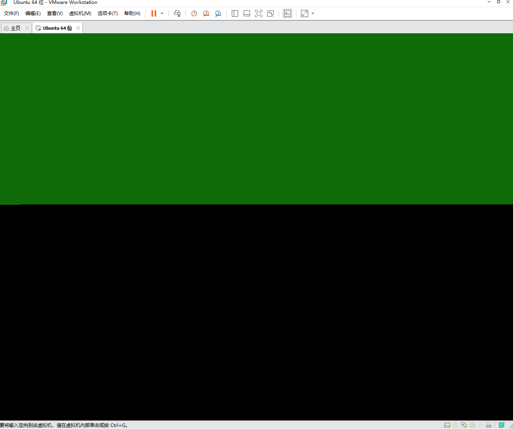

## DRM图形显示框架
DRM把GPU当做DRM设备， 在/dev/dri/cardX创建设备文件与之连接。

1. libdrm 接口库

	对底层接口的封装。对各种IOCTL进行封装。

2. Kernel Mode Setting

	正常工作的时候，需要设置显卡或者图形适配器的模式。 负责更新画面和设置参数

3. Graphics Execution Manager

	提供内存管理方法，即buffer的释放。

## DRM图形显示涉及元素：
1. framebuffer

	一块内存区域，驱动和应用层可以访问。不负责显存分配释放。使用前格式化和设置色彩模式。

2. CRTC

	显示控制器。对framebuffer进行扫描，产生时序信号，叠加上planes的内容，传给encoder。

3. encoder

	编码器。将时序信号转换成外部设备需要的信号，将内存的pixel像素编码转为显示器所需要的电信号。

4. connector

	连接器。是一个抽象的数据结构，代表连接的显示设备，可以获得输出设备的相关信息。

5. bridge

	桥接设备。注册encoder之后再接的转换芯片。

6. panel

	各种屏幕，各种LCD、HDMI设备的抽象。

7. fence

	buffer同步机制。防止显示内容出现异步问题。

8. plane

	硬件图层，和framebuffer一样都是内存地址。一个plane代表一个image layer，最终的image由一个或者多个planes组成。

这几个数据结构之间的关系简单抽象一下，大概是长这样

## example
接下来查看源码modeset.c，简单的一个"hello world"程序，将显示器填充简单的颜色。

其中比较重要的几个函数如下，分别用于获取资源、打开设备、设置crtc以及framebuffer的设置等。

modeset设备的结构体，之后会将dev加入到modeset_list中（一个全局的显示器设备列表）
>		struct modeset_dev {
>			struct modeset_dev *next;
>			uint32_t width;
>			uint32_t height;
>			uint32_t stride;
>			uint32_t size;
>			uint32_t handle;
>			uint8_t *map;
>			drmModeModeInfo mode;
>			uint32_t fb;
>			uint32_t conn;
>			uint32_t crtc;
>			drmModeCrtc *saved_crtc;
>};

drmModeResPtr drmModeGetResources(int fd) ， 是获取显示器各种资源的。

>		struct drmModeRes {
>			uint32_t count_fbs;             // 帧缓冲的数量
>  			uint32_t *fbs;                  // 帧缓冲的ID数组
>	   		uint32_t count_crtcs;           // CRTC的数量
>    			uint32_t *crtcs;                // CRTC的ID数组
>    			uint32_t count_connectors;      // 连接器的数量
>    			uint32_t *connectors;           // 连接器的ID数组
>    			uint32_t count_encoders;        // 编码器的数量
>		    	uint32_t *encoders;             // 编码器的ID数组
>		    	uint32_t min_width, min_height; // 最小分辨率
>		    	uint32_t max_width, max_height; // 最大分辨率
>		};

之后就是初始化framebuffer，将crtc / encoder / connector 等建立联系和初始化，一切执行完之后就可以在空白的"画布"上自由发挥了。

下面是整个程序运行和初始化的一个过程，从open 到 最后的设置CRTC模式，都设置好之后就可以在framebuffer上进行draw了。

按CTRL + ALT + F3/4/5/6,将ubuntu切换到无图形化界面，避免/dev/dri/card0被占用，否则会显示permisson denied，最终运行结果如下，运行的时候有些小问题，只显示了一半，不过也不重要了，毕竟你已经成功的在这片宽广的土地上留下了你的一笔，接下来还需要更加深入的探索。

